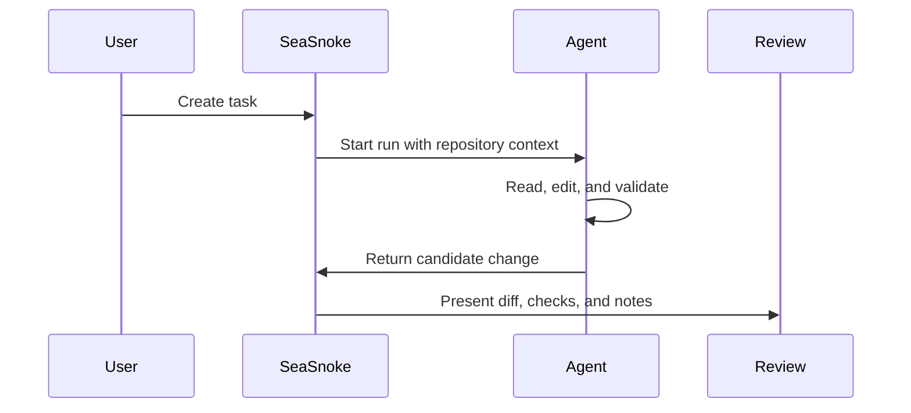

## What Agents Do

Agents turn task instructions into candidate code changes. SeaSnoke keeps their output tied to runs, checks, logs, and review decisions so your team can evaluate the work without switching tools.

Agents operate inside the boundaries of the task. They read the relevant repository context, make a scoped change, and report what they changed. The output is a candidate for review, not an automatic production change.

An agent run usually has four visible phases:

1. **Context gathering:** the agent reads project files, instructions, tests, and related code.
2. **Implementation:** the agent edits the repository to satisfy the task.
3. **Validation:** the agent runs the available checks or records why a check could not run.
4. **Summary:** the agent explains the important files changed, tradeoffs, and remaining risks.



## Writing Effective Instructions

The best instructions describe the desired outcome, constraints, and verification method. They do not need to specify every file if the repository already makes that clear.

Strong task instructions include:

- the user-facing behavior that should change
- the repository or package involved
- known constraints, such as "do not change the public API"
- expected tests or checks
- examples of inputs and outputs when behavior is subtle

Less effective instructions are broad or subjective, such as "make this better" or "clean up the app." Those can still work, but they tend to produce candidates that are harder to review.

```md
Add pagination to the tasks API.

Requirements:
- Accept `limit` and `cursor` query parameters.
- Preserve the current default response for callers that omit pagination.
- Add tests for first page, next page, and invalid cursor.
- Do not change task creation behavior.
```

## Review Signals

- **Diffs** show exactly what changed.
- **Checks** show whether tests and quality gates passed.
- **Notes** summarize the reasoning and tradeoffs behind a candidate.
- **Status** makes it clear whether a run is queued, active, completed, or blocked.

## Agent Statuses

SeaSnoke surfaces agent status so reviewers can tell whether a run is still active or ready to inspect.

Common statuses:

- **Queued:** the run has been accepted and is waiting to start.
- **Running:** the agent is actively working.
- **Needs attention:** the run reached a condition that requires a human decision.
- **Completed:** the run produced a candidate.
- **Failed:** the run could not produce a candidate.
- **Canceled:** the run was stopped before completion.

Failures are still useful. A failed run can reveal missing setup instructions, broken tests, unavailable secrets, or task requirements that need to be narrowed.

## Comparing Agents and Runs

Multiple runs can be useful when the task has several plausible solutions. For example, a reviewer may want to compare a minimal patch against a broader cleanup, or compare two approaches to an API shape.

When comparing runs, focus on:

- correctness against the original task
- size and readability of the diff
- test quality
- compatibility with existing conventions
- deployment or migration risk
- whether the summary matches the actual code

SeaSnoke keeps each candidate separate so the team can make that decision deliberately.

## Human Review Still Matters

Agents can produce useful code quickly, but human review remains the control point. Reviewers should check product behavior, security assumptions, data model changes, and long-term maintainability before a candidate is merged.

Treat agent output the same way you would treat a pull request from a teammate: inspect the diff, run or review checks, ask for revisions when needed, and merge only when the change is understood.
