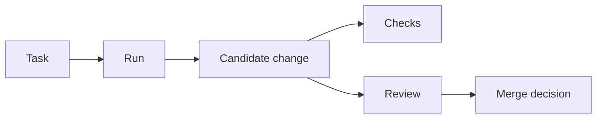

## Task-Based Development

SeaSnoke organizes AI coding work around tasks. A task captures the requested change, links it to the right repository, records the generated runs, and keeps validation results attached to the work.

A task should describe one reviewable outcome. Good tasks are specific enough for an agent to act on, but small enough that a human can review the result without losing context.

Typical tasks include:

- adding an API endpoint
- fixing a regression
- writing or updating tests
- migrating a component
- improving documentation
- applying a narrow refactor

SeaSnoke keeps the task as the durable unit of work. Runs, candidates, logs, checks, comments, and review decisions all attach back to the task so the team can understand what happened and why.

## Runs and Candidates

A run is one attempt to complete a task. A task can have one run or several runs, depending on how your team wants to compare approaches.

Each run produces a candidate change. A candidate is the proposed code, tests, docs, and notes from that run. SeaSnoke treats candidates as reviewable artifacts rather than automatic commits to the main branch.

This makes it possible to:

- compare multiple solutions for the same task
- discard a candidate without losing history
- rerun with clearer instructions
- keep validation output attached to the exact code it tested
- select the most appropriate result before opening or updating a pull request

## Repository Context

SeaSnoke works best when the repository already has clear project conventions. Agents use the task instructions, repository files, existing tests, and project guidance to produce a candidate that fits the codebase.

Useful repository guidance includes:

- how to install dependencies
- how to run tests and lint checks
- where API, frontend, worker, and docs code live
- naming conventions for branches and commits
- review requirements for risky areas
- project-specific instructions in files such as `AGENTS.md`

The goal is not to replace engineering judgment. The goal is to make generated work easier to request, inspect, validate, and merge.

## Candidate Review

SeaSnoke can produce more than one candidate for a task. Reviewers compare the resulting diffs, tests, and notes before deciding what should move forward.

Reviewers usually look at:

- whether the candidate solves the requested task
- whether the diff is appropriately scoped
- whether tests cover the behavior being changed
- whether generated code follows local patterns
- whether there are migrations, configuration changes, or deployment steps
- whether any follow-up work should be tracked separately

SeaSnoke keeps this review step explicit. A passing check is useful, but it is not the same as a product or engineering approval.

## Validated Merge

Generated changes are not merged directly. They go through the checks you configure, then a human review step, before they become part of the target branch.

A typical path looks like this:

1. Create a task with the requested outcome.
2. Start one or more runs.
3. Inspect the candidates in the Review Graph.
4. Review diffs, tests, logs, and notes.
5. Select the candidate that should move forward.
6. Open or update the pull request.
7. Merge after repository checks and human review pass.

## When to Split Work

Split a task when the requested change has multiple review surfaces. For example, "add billing" is usually too broad, while "add billing plan model", "add checkout endpoint", and "add account billing UI" are easier to validate independently.

Keep a task together when the files must change as one unit to stay meaningful. For example, an API response type and its serializer test usually belong in the same task.

Good task boundaries reduce review time and make failed runs easier to diagnose.
