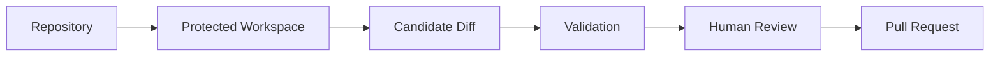

## Separation

SeaSnoke keeps generated work separated from production systems. Agent changes are prepared in controlled workspaces and must pass review before they can be merged.

Protected Workspaces are the boundary between generated work and the repository state your team depends on. They let agents prepare candidate changes without treating those changes as trusted until review and validation have happened.

This separation protects the normal development flow:

- generated changes start outside the target branch
- checks run against the candidate, not against production
- reviewers inspect the diff before merge
- repository permissions still decide what can land
- failed or rejected candidates can be discarded without polluting history



## What Workspaces Contain

A workspace contains the repository checkout, task context, generated changes, and validation output for a run. It is the place where candidate work is prepared and tested.

Reviewers do not need to understand the workspace implementation. The important product behavior is that work is isolated until the team chooses to move it forward.

Workspace output usually includes:

- changed files
- command logs
- test results
- generated notes
- candidate metadata
- links back to the task and run

## Access Controls

Use repository permissions, workspace settings, and CI checks to decide what agents can access and what must be reviewed by a human.

```yaml
repositories:
  default_branch: main
  require_review: true
checks:
  test: required
  lint: required
  security: optional
```

Access rules should be stricter for repositories that contain production code, deployment configuration, customer data paths, or security-sensitive logic.

Common controls include:

- limiting which repositories can be used
- requiring human review before merge
- requiring repository checks before selection
- restricting secret access during generated runs
- preventing direct writes to protected branches
- recording logs and decisions for later audit

## Secrets and Configuration

Agents should receive only the configuration needed to complete the task. If a task can be validated with local tests, it should not need production credentials. If integration credentials are required, they should be scoped, rotated, and separated from production access.

Recommended defaults:

- prefer read-only credentials where possible
- use test or staging services for validation
- avoid exposing deployment credentials to routine coding tasks
- keep secret names descriptive but not embedded in docs or task text
- review tasks that request new secrets or broader access

## Branch Protection

Protected Workspaces work alongside normal branch protection. SeaSnoke should not be the only control protecting important branches.

Use repository settings to enforce:

- required status checks
- required pull request review
- signed commits if your organization requires them
- code owner review for sensitive paths
- restrictions on who can push to protected branches

SeaSnoke then adds a clearer task and candidate review flow on top of those repository rules.

## Audit Trail

A useful workspace leaves a trail that answers basic review questions:

- who created the task
- which repository and branch were targeted
- which run produced the candidate
- what files changed
- which checks ran
- who selected or rejected the candidate
- which pull request received the change

This audit trail helps teams understand both successful changes and rejected attempts.

## Safe Defaults

For most teams, a good starting policy is:

```yaml
workspace_policy:
  require_review: true
  allow_protected_branch_writes: false
  secrets:
    default_access: none
    allow_staging: true
  checks:
    typecheck: required
    lint: required
    tests: required
```

Adjust the policy by repository. A docs repository may allow simpler validation. A production service should require stronger checks and tighter access.
