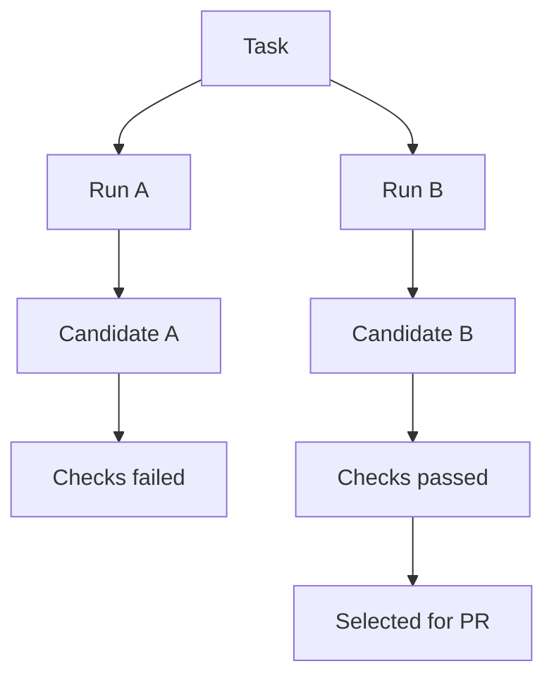

## What is the Review Graph?

The Review Graph shows the candidate changes produced for a task. It helps reviewers compare approaches, inspect validation results, and choose what should move forward.

It is designed for tasks where a simple linear history is not enough. A task may have retries, alternative approaches, follow-up runs, or candidates that were abandoned after review. The Review Graph keeps those attempts visible without forcing every attempt into the final branch history.

## What You Can Inspect

Each item shows status, checks, files changed, and diff size. Select a candidate to inspect the full diff, test output, and review notes.

The Review Graph is useful because it connects review signals that are usually scattered across tools:

- the task that requested the change
- the run that produced the candidate
- the changed files
- validation output
- agent notes
- reviewer decisions
- pull request state, when a candidate moves forward

## Candidate Cards

Candidate cards summarize the information a reviewer needs before opening the full diff.

Typical card fields include:

- run status
- branch or candidate identifier
- number of files changed
- additions and deletions
- check status
- creation time
- final summary
- reviewer decision

Use the card to decide where to spend attention. A large diff with failing checks may need a different review path than a small candidate with focused tests.

## Diff Review

The diff is the source of truth. Notes and check output help, but reviewers should still inspect the code that would enter the repository.

When reviewing a candidate, check:

- whether the changed files match the task scope
- whether unrelated formatting or churn was introduced
- whether public interfaces changed
- whether errors are handled explicitly
- whether tests cover the behavior that matters
- whether documentation or examples need to change

For API changes, confirm the request and response shapes are intentional. For frontend changes, confirm loading, empty, error, and mobile states. For worker or automation changes, confirm retry behavior and failure reporting.

## Validation Results

Validation results show what was checked against the candidate. These can include tests, lint, type checks, formatting, security checks, or custom repository commands.

Passing validation means the configured checks passed. It does not prove the implementation is correct in every environment. Failing validation does not always mean the idea is wrong; it may reveal a missing dependency, flaky test, or incomplete setup.

Useful validation output answers:

- what command ran
- whether it passed or failed
- how long it took
- what logs or errors matter
- whether the failure is related to the candidate

## Review Decisions

SeaSnoke separates candidate generation from review decisions. A reviewer can select a candidate, request another run, leave notes, or decide that no candidate should move forward.

Common decisions:

- **Select:** this candidate should become the proposed change.
- **Revise:** the candidate is close, but needs another pass.
- **Reject:** the approach should not move forward.
- **Hold:** more product or engineering context is needed.

This makes review history useful later. Teams can see not only what was merged, but which alternatives were considered and why they were not chosen.

## Practical Review Flow

1. Open the task and confirm the requested outcome.
2. Scan all candidates in the Review Graph.
3. Ignore candidates that clearly failed or drifted from scope.
4. Inspect the strongest candidate diff.
5. Read validation output for relevant checks.
6. Compare against another candidate if the decision is not obvious.
7. Select, revise, or reject with a short reason.

Short review notes are enough. The goal is to make future readers understand the decision without writing a separate report.
