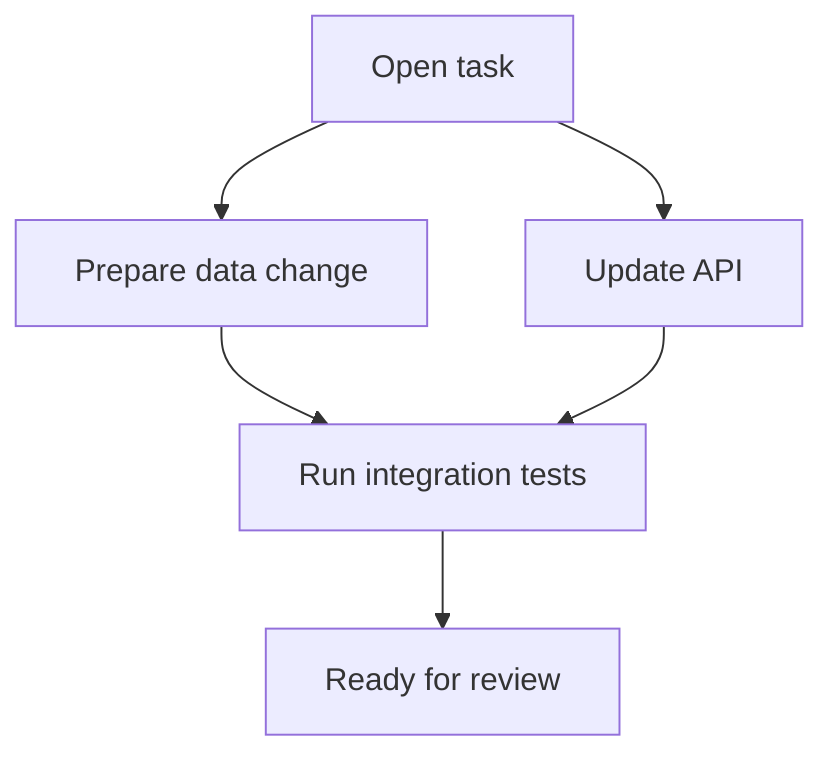

## Task Dependencies

Tasks can depend on other tasks. SeaSnoke uses those dependencies to decide what is ready to run and what still needs to wait.



```yaml
dependencies:
  - task: setup-database
  - task: generate-migrations
    optional: true
```

## Retry Policies

Configure retries for transient failures:

```yaml
retry:
  max_attempts: 3
  backoff: exponential
  base_delay: 5s
```
