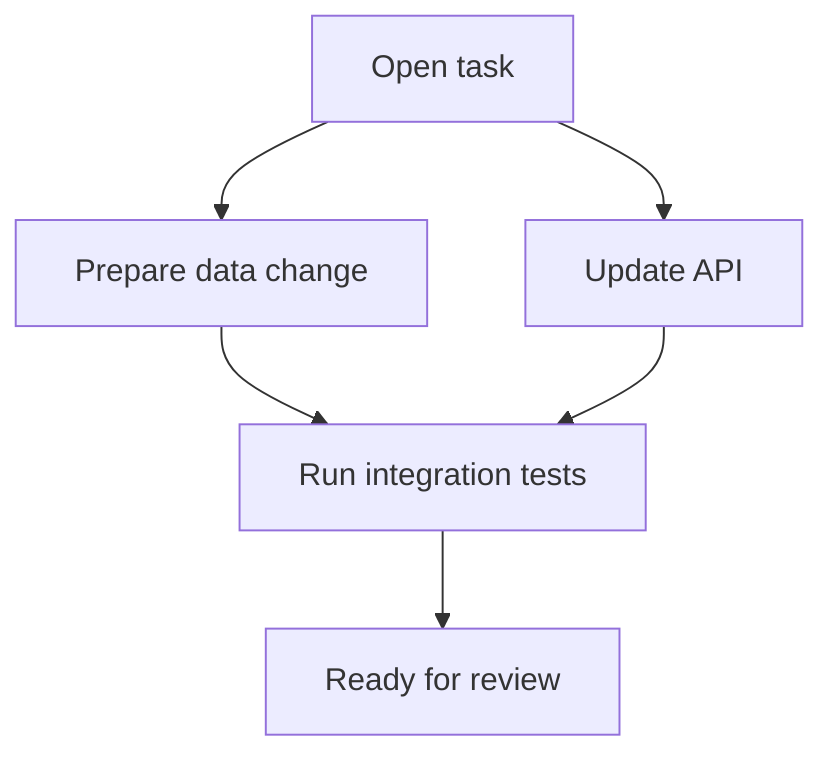
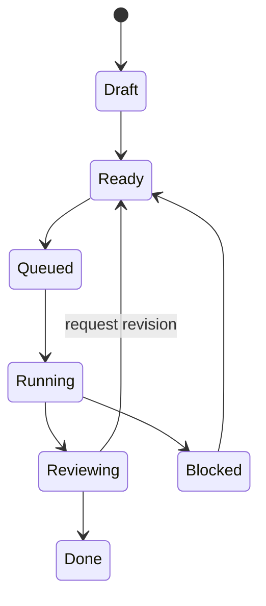

## Task Dependencies

Tasks can depend on other tasks. SeaSnoke uses those dependencies to decide what is ready to run and what still needs to wait.



```yaml
dependencies:
  - task: setup-database
  - task: generate-migrations
    optional: true
```

Dependencies help teams break larger product work into smaller reviewable tasks without losing ordering. A task that changes a database shape may need to complete before a task that updates an API. A frontend task may wait for the API contract to be selected.

Use dependencies when:

- one task needs code produced by another task
- validation would be misleading until another task lands
- two tasks touch the same sensitive files
- review should happen in a known order
- a product milestone needs visible progress across several tasks

Avoid dependencies when tasks are truly independent. Extra dependency edges slow work down and make the workflow harder to reason about.

## Workflow States

SeaSnoke workflows move tasks through clear states so teams can see what needs attention.

Common states:

- **Draft:** the task exists but is not ready to run.
- **Ready:** the task has enough context and no blocking dependencies.
- **Queued:** the task is waiting for a run.
- **Running:** a run is active.
- **Reviewing:** one or more candidates are ready for inspection.
- **Blocked:** the task needs human input or an upstream dependency.
- **Done:** the selected change has moved forward.



## Retry Policies

Configure retries for transient failures:

```yaml
retry:
  max_attempts: 3
  backoff: exponential
  base_delay: 5s
```

Retries are useful for failures that are likely to clear without changing the task, such as temporary network failures, unavailable package registries, or flaky checks.

Retries are not a substitute for better instructions. If a run fails because the task is ambiguous, the repository setup is missing, or tests require credentials that are not available, update the task or project configuration before retrying.

## Validation Gates

Validation gates define what must pass before a candidate can be selected or moved into a pull request. Gates can be strict for production repositories and lighter for exploratory work.

Example gates:

```yaml
validation:
  required:
    - pnpm types:check
    - pnpm lint
    - pnpm test
  optional:
    - pnpm e2e
```

For Rust services, a repository might use:

```yaml
validation:
  required:
    - cargo fmt --check
    - cargo clippy --workspace --all-targets -- -D warnings
    - cargo test --workspace
```

Make required gates match the risk of the repository. A documentation-only repository may not need the same gates as a production API.

## Parallel Work

Independent tasks can run at the same time. This is useful when a product change has separate surfaces such as API, CLI, and docs.

Parallel work is a good fit when:

- tasks touch separate files or packages
- each task has its own validation path
- one task does not require decisions from another
- reviewers can evaluate each candidate independently

Parallel work is a poor fit when several tasks modify the same interfaces at the same time. In that case, create a contract task first, then let dependent tasks build against that decision.

## Example Product Workflow

The following workflow splits a feature into reviewable pieces:

```yaml
tasks:
  - id: task-api-contract
    title: Define task pagination response
  - id: task-api-implementation
    title: Implement paginated task listing
    depends_on:
      - task-api-contract
  - id: task-cli-output
    title: Add paginated CLI output
    depends_on:
      - task-api-contract
  - id: task-docs
    title: Document task pagination
    depends_on:
      - task-api-implementation
      - task-cli-output
```

This keeps the contract decision visible, allows API and CLI work to proceed after the contract is selected, and leaves documentation until the behavior is stable.

## Keeping Workflows Reviewable

The most effective workflows make progress visible without creating large, hard-to-review changes.

Use these guidelines:

- keep tasks focused on one outcome
- add dependencies only where order matters
- require validation that matches the repository
- retry transient failures, not unclear tasks
- write short review notes when selecting or rejecting a candidate
- split risky changes before they become difficult to review
