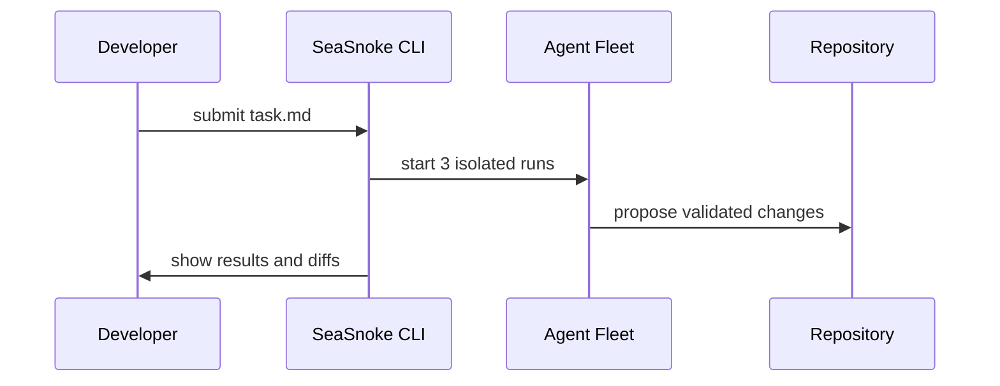

## 1. Authenticate

Log in to your SeaSnoke workspace:

```bash
seasnoke auth login
```

## 2. Initialize a Project

Navigate to your repository and initialize SeaSnoke:

```bash
cd my-project
seasnoke init
```

## 3. Submit Your First Task

Create a task file and submit it:

```bash
cat > task.md << 'EOF'
## Task: Add rate limiting middleware

Implement a Redis-backed rate limiter for the /api/v1/* routes.
- Use sliding window algorithm
- Configurable limits per endpoint
- Return 429 with Retry-After header
EOF

seasnoke task submit task.md --agents 3
```

## 4. Watch the Results

Open the dashboard or watch in your terminal:

```bash
seasnoke runs watch
# Or open the web dashboard
seasnoke dashboard
```


