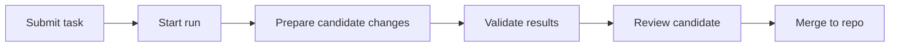

SeaSnoke is an AI coding platform for assigning software tasks, comparing agent-generated changes, and merging only validated work.

## What is SeaSnoke?

SeaSnoke helps teams hand well-scoped work to coding agents without losing review control. You submit a task, SeaSnoke prepares candidate changes, runs validation, and presents the strongest results for human review.

Think of it as a workbench for AI-assisted development: tasks, runs, diffs, checks, and review decisions in one place.

## Key Features

- **Task-Based Workflow**: Describe what needs to change and track it from assignment through review.
- **Candidate Comparison**: Compare generated approaches by tests, diffs, and review status.
- **Protected Execution**: Agent work runs away from production systems and is reviewed before merge.
- **Validated Merge Flow**: Only changes that pass configured checks are presented as merge candidates.

## How It Works

1. **Submit a Task**: Describe what you want built in natural language. SeaSnoke parses requirements and generates a task specification.
2. **Agents Prepare Changes**: SeaSnoke creates one or more candidate implementations for the task.
3. **Validation Runs**: Tests, linting, and configured checks run against each candidate.
4. **Validation & Merge**: Successful agent outputs are validated, compared, and presented for your final review and merge.
